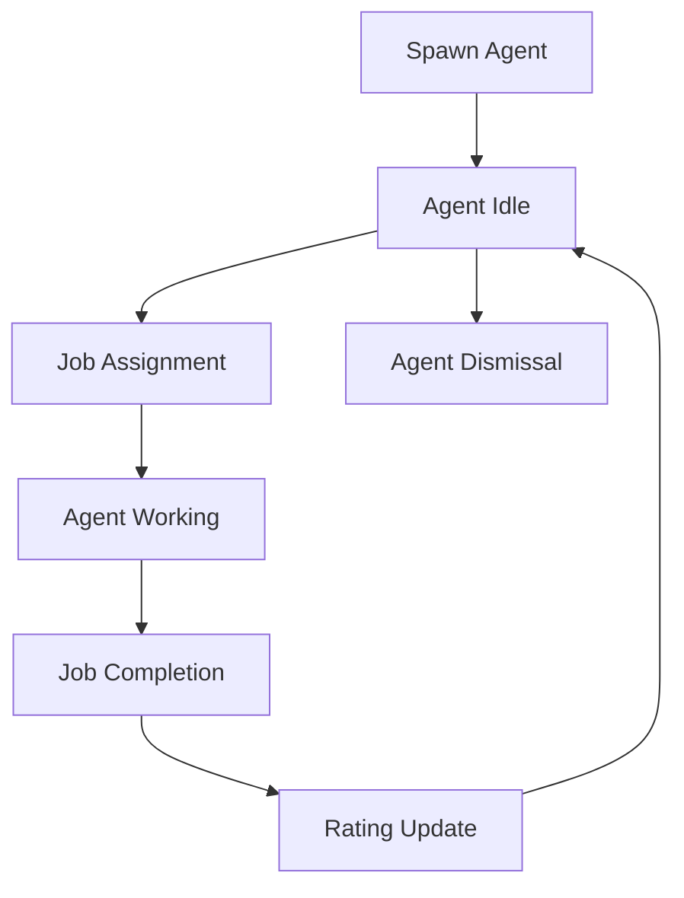
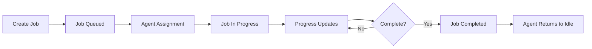

# 🤖 AI Agent System Guide

## Overview

The AI Agent System is a sophisticated job-based AI management system designed for the multiplayer planetary shooter game. It provides intelligent automation, task management, and real-time coordination capabilities.

## 🏗️ System Architecture

### Core Components

1. **AI Agents**: Specialized AI entities with unique capabilities and roles
2. **Job Queue**: Task management system with priority-based assignment
3. **Real-time Processing**: Continuous job execution and progress tracking
4. **API Integration**: RESTful API for frontend and external system integration

### Agent Types & Capabilities

| Agent Type | Primary Role | Capabilities | Base Rating | Memory |
|------------|--------------|--------------|-------------|---------|
| **Navigator** | Pathfinding specialist | pathfinding, spatial_analysis, route_optimization | 4.2 | 50/200 |
| **Strategist** | Tactical planning expert | tactical_planning, combat_analysis, resource_management | 4.5 | 75/300 |
| **Engineer** | System repair technician | system_repair, technical_analysis, equipment_optimization | 4.3 | 60/250 |
| **Scout** | Exploration specialist | exploration, intelligence_gathering, threat_assessment | 4.0 | 40/150 |
| **Coordinator** | Team coordination manager | team_coordination, communication, priority_management | 4.4 | 80/400 |

## 🔧 How It Works

### 1. Agent Lifecycle



### 2. Job Processing Flow



### 3. Real-time Updates

- **Progress Tracking**: Jobs update every 2 seconds
- **Agent Status**: Real-time status monitoring
- **System Statistics**: Live performance metrics
- **Event Notifications**: Immediate status changes

## 📡 API Endpoints

### Agent Management

#### Spawn Agent
```http
POST /api/agents/spawn
Content-Type: application/json

{
  "role": "navigator"
}
```

**Response:**
```json
{
  "success": true,
  "agent": {
    "id": "agent_1",
    "name": "Navigator 1",
    "role": "navigator",
    "status": "idle",
    "capabilities": ["pathfinding", "spatial_analysis", "route_optimization"],
    "rating": 4.2,
    "memory": {"shortTerm": 50, "longTerm": 200}
  }
}
```

#### Get All Agents
```http
GET /api/agents
```

#### Upgrade Agent
```http
PUT /api/agents/{agentId}/upgrade
Content-Type: application/json

{
  "capability": "advanced_analysis"
}
```

#### Dismiss Agent
```http
DELETE /api/agents/{agentId}
```

### Job Management

#### Create Job
```http
POST /api/jobs/create
Content-Type: application/json

{
  "type": "pathfinding",
  "description": "Find optimal route to target",
  "priority": "high"
}
```

**Response:**
```json
{
  "success": true,
  "job": {
    "id": "job_1",
    "name": "Pathfinding",
    "type": "pathfinding",
    "description": "Find optimal route to target",
    "status": "in_progress",
    "priority": "high",
    "assignedTo": "agent_1",
    "progress": 0,
    "estimatedDuration": 2
  }
}
```

#### Get All Jobs
```http
GET /api/jobs
```

#### Cancel Job
```http
DELETE /api/jobs/{jobId}
```

#### Update Job Priority
```http
PUT /api/jobs/{jobId}/priority
Content-Type: application/json

{
  "priority": "low"
}
```

### System Monitoring

#### Health Check
```http
GET /api/health
```

#### System Statistics
```http
GET /api/game/status
```

**Response:**
```json
{
  "stats": {
    "totalAgents": 5,
    "activeAgents": 3,
    "totalJobs": 10,
    "queuedJobs": 2,
    "inProgressJobs": 3,
    "completedJobs": 5,
    "averageRating": 4.32
  }
}
```

## 🎮 Usage Examples

### Example 1: Planetary Invasion Mission

```javascript
// Spawn invasion team
const invasionTeam = [
  { role: 'strategist', name: 'Commander Alpha' },
  { role: 'navigator', name: 'Pathfinder Beta' },
  { role: 'scout', name: 'Recon Gamma' },
  { role: 'engineer', name: 'Tech Delta' },
  { role: 'coordinator', name: 'Control Echo' }
];

// Deploy team
for (const member of invasionTeam) {
  await fetch('/api/agents/spawn', {
    method: 'POST',
    headers: { 'Content-Type': 'application/json' },
    body: JSON.stringify({ role: member.role })
  });
}

// Assign invasion missions
const invasionJobs = [
  {
    type: 'tactical_analysis',
    description: 'Analyze enemy defensive positions',
    priority: 'high'
  },
  {
    type: 'pathfinding',
    description: 'Calculate safest approach routes',
    priority: 'high'
  },
  {
    type: 'exploration',
    description: 'Scout enemy base perimeter',
    priority: 'high'
  }
];

for (const job of invasionJobs) {
  await fetch('/api/jobs/create', {
    method: 'POST',
    headers: { 'Content-Type': 'application/json' },
    body: JSON.stringify(job)
  });
}
```

### Example 2: Emergency Response

```javascript
// Emergency system failure response
const emergencyJobs = [
  {
    type: 'system_repair',
    description: 'URGENT: Repair critical life support systems',
    priority: 'high'
  },
  {
    type: 'team_coordination',
    description: 'Coordinate emergency protocols',
    priority: 'high'
  },
  {
    type: 'tactical_analysis',
    description: 'Assess damage extent',
    priority: 'high'
  }
];

// Create emergency response
for (const job of emergencyJobs) {
  await fetch('/api/jobs/create', {
    method: 'POST',
    headers: { 'Content-Type': 'application/json' },
    body: JSON.stringify(job)
  });
}
```

### Example 3: Resource Management

```javascript
// Resource optimization scenario
const resourceJobs = [
  {
    type: 'tactical_analysis',
    description: 'Analyze resource consumption patterns',
    priority: 'high'
  },
  {
    type: 'exploration',
    description: 'Search for new resource deposits',
    priority: 'high'
  },
  {
    type: 'team_coordination',
    description: 'Coordinate resource allocation',
    priority: 'medium'
  }
];
```

## 🔄 Real-time Monitoring

### Frontend Integration

```javascript
// Connect to AI agent service
const aiService = new AIAgentService();
await aiService.connect();

// Listen for real-time updates
aiService.addListener((data) => {
  console.log('Agents:', data.agents);
  console.log('Jobs:', data.jobs);
  console.log('Stats:', data.stats);
});

// Spawn agent
const agent = await aiService.spawnAgent('navigator');

// Create job
const job = await aiService.createJob('pathfinding', 'Find route to target', 'high');
```

### WebSocket Events (Future Enhancement)

```javascript
// Real-time agent status updates
socket.on('agentUpdate', (data) => {
  console.log('Agent updated:', data);
});

// Job progress updates
socket.on('jobProgress', (data) => {
  console.log('Job progress:', data);
});

// System alerts
socket.on('systemAlert', (data) => {
  console.log('System alert:', data);
});
```

## 📊 Performance Metrics

### Key Performance Indicators

1. **Agent Utilization Rate**: Percentage of active agents
2. **Job Completion Rate**: Success rate of job completion
3. **Average Agent Rating**: Overall agent performance
4. **Response Time**: Time from job creation to assignment
5. **Queue Length**: Number of pending jobs

### Performance Analysis

```javascript
// Get system performance metrics
const stats = await fetch('/api/game/status').then(r => r.json());

const performance = {
  efficiency: (stats.stats.activeAgents / stats.stats.totalAgents) * 100,
  completionRate: (stats.stats.completedJobs / stats.stats.totalJobs) * 100,
  averageRating: stats.stats.averageRating,
  queueStatus: stats.stats.queuedJobs === 0 ? 'Optimal' : 'Backlogged'
};
```

## 🎯 Best Practices

### Agent Management

1. **Role Specialization**: Use agents for their specific capabilities
2. **Balanced Teams**: Maintain diverse agent types for different scenarios
3. **Performance Monitoring**: Regularly check agent ratings and upgrade underperformers
4. **Resource Management**: Dismiss idle agents to conserve resources

### Job Creation

1. **Clear Descriptions**: Provide detailed job descriptions for better execution
2. **Priority Setting**: Use appropriate priority levels (high, medium, low)
3. **Job Types**: Match job types to agent capabilities
4. **Monitoring**: Track job progress and completion rates

### System Optimization

1. **Load Balancing**: Distribute jobs evenly across available agents
2. **Queue Management**: Monitor job queue length and agent availability
3. **Performance Tuning**: Adjust agent upgrade frequency based on performance
4. **Error Handling**: Implement proper error handling for failed jobs

## 🚀 Advanced Features

### Agent Upgrades

Agents can be upgraded with new capabilities:

```javascript
// Upgrade agent with new capability
await fetch(`/api/agents/${agentId}/upgrade`, {
  method: 'PUT',
  headers: { 'Content-Type': 'application/json' },
  body: JSON.stringify({ capability: 'advanced_analysis' })
});
```

### Job Priority Management

Jobs can be reprioritized dynamically:

```javascript
// Update job priority
await fetch(`/api/jobs/${jobId}/priority`, {
  method: 'PUT',
  headers: { 'Content-Type': 'application/json' },
  body: JSON.stringify({ priority: 'high' })
});
```

### System Health Monitoring

Continuous system health monitoring:

```javascript
// Health check
const health = await fetch('/api/health').then(r => r.json());

if (health.status === 'healthy') {
  console.log('System operational');
} else {
  console.log('System issues detected');
}
```

## 🔧 Configuration

### Agent Configuration

```javascript
const agentConfig = {
  navigator: {
    baseMemory: { shortTerm: 50, longTerm: 200 },
    baseRating: 4.2,
    capabilities: ['pathfinding', 'spatial_analysis', 'route_optimization']
  },
  strategist: {
    baseMemory: { shortTerm: 75, longTerm: 300 },
    baseRating: 4.5,
    capabilities: ['tactical_planning', 'combat_analysis', 'resource_management']
  }
  // ... other agent types
};
```

### Job Configuration

```javascript
const jobConfig = {
  pathfinding: {
    estimatedDuration: 2,
    requiredCapability: 'pathfinding',
    priority: 'medium'
  },
  tactical_analysis: {
    estimatedDuration: 5,
    requiredCapability: 'tactical_planning',
    priority: 'high'
  }
  // ... other job types
};
```

## 🎮 Integration with Game Systems

### Player Integration

```javascript
// Player joins game
const player = await fetch('/api/players/join', {
  method: 'POST',
  headers: { 'Content-Type': 'application/json' },
  body: JSON.stringify({ playerName: 'Commander' })
});

// AI agents assist player
const assistanceJob = await fetch('/api/jobs/create', {
  method: 'POST',
  headers: { 'Content-Type': 'application/json' },
  body: JSON.stringify({
    type: 'tactical_analysis',
    description: 'Assist player with combat strategy',
    priority: 'high'
  })
});
```

### Multiplayer Coordination

```javascript
// Coordinate multiple players
const coordinationJob = await fetch('/api/jobs/create', {
  method: 'POST',
  headers: { 'Content-Type': 'application/json' },
  body: JSON.stringify({
    type: 'team_coordination',
    description: 'Coordinate multi-player assault',
    priority: 'high'
  })
});
```

## 🔮 Future Enhancements

### Planned Features

1. **Machine Learning Integration**: Adaptive agent behavior based on game patterns
2. **Advanced Job Types**: More complex multi-step job workflows
3. **Agent Specialization**: Deep specialization in specific game mechanics
4. **Predictive Analytics**: Anticipate player needs and pre-assign agents
5. **Dynamic Scaling**: Automatic agent spawning based on workload

### API Extensions

1. **WebSocket Support**: Real-time bidirectional communication
2. **Event Streaming**: Continuous event updates
3. **Batch Operations**: Bulk agent and job management
4. **Advanced Filtering**: Complex query capabilities
5. **Analytics API**: Detailed performance analytics

---

## 📝 Summary

The AI Agent System provides a robust, scalable foundation for intelligent automation in the multiplayer planetary shooter game. With its job-based architecture, real-time processing, and comprehensive API, it enables sophisticated AI-driven gameplay experiences.

Key benefits:
- **Intelligent Automation**: Automated task execution and decision-making
- **Scalable Architecture**: Handles multiple agents and jobs efficiently
- **Real-time Processing**: Immediate response to game events
- **Flexible Integration**: Easy integration with game systems
- **Performance Monitoring**: Comprehensive metrics and analytics

The system is designed to enhance player experience by providing intelligent assistance, automated resource management, and coordinated team operations. 