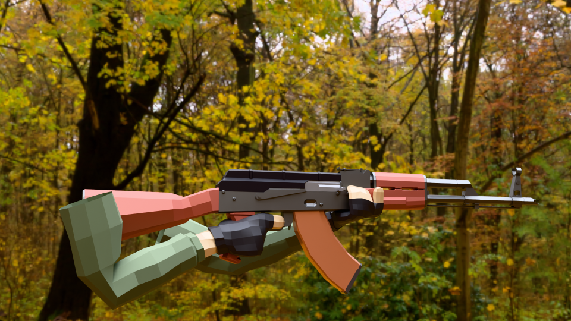
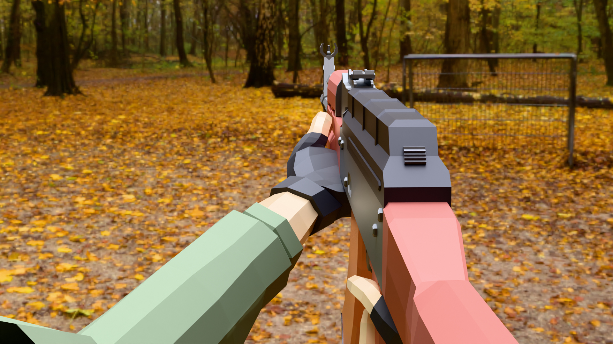

# 🌌 Rekursing - Recursive AI Gaming

> For index reference format, see [INDEX_DESCRIBER.md](./INDEX_DESCRIBER.md)  <!-- IDX-DOC-00 -->

# IDX-DOC-01: Features

A revolutionary multiplayer planetary shooter where AI systems recursively learn and improve from every player interaction, creating an ever-evolving gaming experience built with Three.js, mathematical physics integration, coordinate-based thinking, and trending GitHub integrations.

📜 License: This project is licensed under the MIT License. See the LICENSE file for details

### Core Gameplay
- **Recursive AI Gaming**: AI systems that continuously learn and improve from every interaction
- **Multiplayer Planetary Combat**: Real-time multiplayer combat across 4 unique planets
- **Planetary Physics**: Each planet has unique gravity, atmosphere, and environmental effects
- **Advanced Weapon System**: 7 different weapon types with unique mechanics
- **Mathematical Integration**: Fine structure constant (α = 1/137) and complex mathematical systems influence gameplay
- **Trending GitHub Integrations**: 7 trending repositories with AI-powered development tools

This project builds upon the foundations of the original example while introducing improvements like sound effects, a camera attached to the rig, and animations synced with actions like shooting and idle to create a more immersive FPS experience.

### AI Systems
- **15 Specialized AI Agents**: Each with unique roles and capabilities for system optimization
- **Recursive Learning**: AI systems that continuously improve from every interaction
- **Mathematical AI**: Neural network-driven AI that adapts to player behavior
- **Pattern Recognition**: Real-time analysis of player actions and mathematical patterns
- **Adaptive Difficulty**: Dynamic difficulty adjustment based on player performance
- **Thought Monitoring**: Real-time observation of AI reasoning processes
- **Trending GitHub Integrations**: 7 trending repositories with AI-powered development tools
- **Advanced AI Coordination**: Quantum-inspired coordination with 8 AI agents

### Technical Features
- **Real-time Networking**: Socket.io-based multiplayer with low latency
- **Advanced Rendering**: Three.js with PBR materials, dynamic lighting, and procedural skies
- **Performance Optimization**: Efficient rendering pipeline with LOD systems
- **Modular Architecture**: Clean, maintainable codebase with comprehensive documentation
- **System Interconnectivity Matrix**: Revolutionary visualization of program interconnectivity and butterfly effects
- **Spatial Function Clustering Matrix**: Spatial optimization and refactoring suggestions
- **Coordinate-Based Thinking**: Functions positioned in 3D space based on calling relationships

## 🛠️ Technology Stack

- **Frontend**: Three.js, Vite, ES6 Modules
- **Backend**: Node.js, Socket.io, Express
- **Physics**: Custom mathematical physics engine
- **AI**: Neural networks with mathematical pattern recognition
- **Networking**: Real-time WebSocket communication

## 📦 Installation

### Prerequisites
- Node.js (v18 or higher)
- npm or yarn

### Setup
```bash
# Clone the repository
git clone https://github.com/yourusername/rekursing.git
cd rekursing

# Install dependencies
npm install

# Start the development server
npm start
```

The game will be available at:
- **Game**: http://localhost:3001
- **Development Server**: http://localhost:3000
- **Live Demo**: https://rekursing.com

## 🎮 Controls

### Movement
- **WASD**: Move
- **Space**: Jump
- **Shift**: Dash (with cooldown)
- **V**: Toggle camera mode (First/Third person)

### Combat
- **Left Click**: Shoot
- **Mouse Wheel**: Switch weapons
- **1-7**: Quick weapon selection
- **R**: Reload

### Object Generation
- **G**: Generate Kameeldoring tree
- **H**: Generate random tree
- **J**: Clear all generated objects
- **K**: Inspect objects

### Tools
- **F1**: Debug Console
- **F2**: Performance Monitor
- **F3**: Network Analyzer
- **F4**: Gameplay Enhancer
- **F8**: System Interconnectivity Matrix
- **F10**: Spatial Function Clustering Matrix
- **F9**: Trigger Butterfly Effect

## 🌍 Planets

### Earth
- **Gravity**: Standard (-30)
- **Atmosphere**: Blue sky, green terrain
- **Special**: Balanced gameplay

### Mars
- **Gravity**: Low (-12)
- **Atmosphere**: Red sky, rocky terrain
- **Special**: Enhanced jumping, reduced accuracy

### Moon
- **Gravity**: Very low (-5)
- **Atmosphere**: Dark sky, gray terrain
- **Special**: Extreme jumping, precise shooting

### Jupiter
- **Gravity**: High (-50)
- **Atmosphere**: Orange sky, golden terrain
- **Special**: Heavy movement, powerful weapons

### Venus
- **Gravity**: Medium (-25)
- **Atmosphere**: Pink sky, sandy terrain
- **Special**: Balanced with unique visual effects

## 🔧 Development

### Project Structure
```
Coordinates/
├── src/                    # Source code
│   ├── main.js            # Main game loop
│   ├── mathematical-engine.js
│   ├── mathematical-ai.js
│   ├── mathematical-visualizer.js
│   ├── flow-diagram-visualizer.js
│   ├── system-interconnectivity-matrix.js
│   └── style.css
├── game_describers/       # Documentation and diagrams
├── tools/                 # Development tools
├── universal-object-generator.js
├── server.js             # Multiplayer server
└── package.json
```

### Key Systems

#### Mathematical Engine
- Fine structure constant integration
- Complex number calculations
- Fractal and quantum effects
- Real-time mathematical analysis

#### Universal Object Generator
- Voxel-based generation
- Marching Cubes algorithm
- Procedural texturing
- Behavior attachment

#### AI System
- 8-input neural network
- Pattern recognition
- Adaptive responses
- Mathematical analysis

#### System Interconnectivity Matrix

#### Spatial Function Clustering Matrix
- Real-time function interconnectivity visualization
- Butterfly effect propagation tracking
- Multi-perspective system views
- Mathematical constant integration

### Building for Production
```bash
# Build the project
npm run build

# Start production server
npm run start:prod
```

## 🤝 Contributing

1. Fork the repository
2. Create a feature branch (`git checkout -b feature/amazing-feature`)
3. Commit your changes (`git commit -m 'Add amazing feature'`)
4. Push to the branch (`git push origin feature/amazing-feature`)
5. Open a Pull Request

### Development Guidelines
- Follow the existing code style
- Add comprehensive documentation
- Include tests for new features
- Update flow diagrams for architectural changes

## 📊 Performance

### Optimization Features
- **LOD Systems**: Level of detail for distant objects
- **Frustum Culling**: Only render visible objects
- **Object Pooling**: Efficient memory management
- **Network Optimization**: Compressed data transmission

### System Requirements
- **Minimum**: 4GB RAM, Intel i3/AMD equivalent
- **Recommended**: 8GB RAM, Intel i5/AMD equivalent
- **Graphics**: WebGL 2.0 compatible GPU

## 🐛 Troubleshooting

### Common Issues

#### Port Already in Use
```bash
# Kill processes on port 3001
npx kill-port 3001
npm start
```

#### Performance Issues
- Reduce graphics quality in settings
- Close other browser tabs
- Check for background processes

#### Connection Issues
- Verify server is running
- Check firewall settings
- Ensure stable internet connection

## 📄 License

This project is licensed under the MIT License - see the [LICENSE](LICENSE) file for details.

## 🙏 Acknowledgments

- **Three.js Community**: For the amazing 3D graphics library
- **Socket.io**: For real-time networking capabilities
- **Mathematical Community**: For inspiration in mathematical game design
- **Trending GitHub Integrations**: 7 trending repositories with AI-powered development tools

## 📞 Support

- **Issues**: [GitHub Issues](https://github.com/yourusername/multiplayer-planetary-shooter/issues)
- **Discussions**: [GitHub Discussions](https://github.com/yourusername/multiplayer-planetary-shooter/discussions)
- **Documentation**: [Wiki](https://github.com/yourusername/multiplayer-planetary-shooter/wiki)

## **🔑 Key Features**

- ✅ Three.js – High-performance 3D rendering
- ✅ GLTFLoader – Efficient 3D model loading
- ✅ Octree Physics – Smooth collision detection & movement
- ✅ Modular Architecture – Clean, scalable, and easy to maintain
- ✅ Sound & Music Integration – Immersive SFX & ambient audio
- ✅ Trending GitHub Integrations – 7 trending repositories with AI-powered tools
- ✅ Advanced AI Coordination – Quantum-inspired coordination with 8 AI agents

🎯 Ideal for: Game developers, 3D enthusiasts, and anyone exploring browser-based FPS mechanics.

## IDX-TREEHYBRID: Hybrid L-System + Space Colonization Tree Generator
A new procedural tree generator combines L-Systems for main structure and Space Colonization for fine branching and leaf distribution. See implementation plan in [src/procedural-tree-voxel.js](src/procedural-tree-voxel.js) (IDX-TREEHYBRID-PLAN).

### Approach Overview
- **L-Systems**: Generate the main tree skeleton and primary branching structure
- **Space Colonization**: Add fine branches and distribute leaves naturally
- **Benefits**: Combines structural control with organic distribution
- **Industry Standard**: Similar to SpeedTree and other professional tools

### Implementation Status
- [x] Implementation plan documented (IDX-TREEHYBRID-PLAN)
- [ ] L-System skeleton generation
- [ ] Space colonization fine branching
- [ ] Mesh generation and optimization
- [ ] Parameter controls and presets
- [ ] Documentation and examples

### Technical Details
The hybrid approach addresses limitations of single-method approaches:
- L-Systems alone can be too rigid and predictable
- Space colonization alone lacks structural control
- Combined approach provides both control and natural variation

---

**Made with ❤️ and Mathematics** 

# LLM Provider Setup & Usage

This project supports multiple LLM providers for AI agent thinking and dashboard features. To enable real LLMs, follow these steps:

## Local LLMs

### LM Studio
- Download and install LM Studio: https://lmstudio.ai/
- Start the local server: `lms server start`
- The backend will auto-detect LM Studio at `http://localhost:1234/v1`

### Ollama
- Download and install Ollama: https://ollama.com/
- Start the Ollama server: `ollama serve`
- The backend will auto-detect Ollama at `http://localhost:11434`

## Cloud/Free APIs

### OpenAI (Free Tier)
- Get an API key from https://platform.openai.com/
- Set the environment variable `OPENAI_API_KEY` before starting the server.

### Anthropic (Free Tier)
- Get an API key from https://console.anthropic.com/
- Set the environment variable `ANTHROPIC_API_KEY` before starting the server.

### HuggingFace (Free Tier)
- Get an API key from https://huggingface.co/settings/tokens
- Set the environment variable `HUGGINGFACE_API_KEY` before starting the server.

## Usage
- The backend will auto-detect and connect to any available LLM provider.
- The dashboard will show LLM status and allow switching between providers.
- To test LLM endpoints, run: `node test-llm-comprehensive.js`

---

## **🎨 3D Model Credits**

**"FPS Rig AKM"** by **J-Toastie** [CC-BY] via **Poly Pizza**



---

## **⚡ Installation & Setup**

Get started with this project in a few simple steps:

### **1️⃣ Clone the Repository**

```sh
git clone https://github.com/Footprintarts/ThreeJS_FPS_2.0.git
```

### **2️⃣ Navigate to the Project Directory**

```sh
cd your-project
```

### **3️⃣ Install Dependencies**

```sh
npm install
```

### **4️⃣ Start the Development Server**

```sh
npm run dev
```

This will launch the project in your default web browser.

---

## **🎯 Features & Functionality**

### **🛠 3D Model & Animation System**

- **GLTF Model Loader**: Loads FPS rig & animations
- **Animation Mixer**: Plays shooting & reloading animations
- **Smooth Camera Handling**

### **🎮 First-Person Controls**

- **WASD for Movement**
- **Mouse Look** (Pointer Lock API)
- **Space to Jump**
- **Left Click to Shoot**
## **🎨 3D Model Credits**

**"FPS Rig AKM"** by **J-Toastie** [CC-BY] via **Poly Pizza**


---

## **⚡ Installation & Setup**

Get started with this project in a few simple steps:

### **1️⃣ Clone the Repository**

```sh
git clone https://github.com/Footprintarts/ThreeJS_FPS_2.0.git
```

### **2️⃣ Navigate to the Project Directory**

```sh
cd your-project
```

### **3️⃣ Install Dependencies**

```sh
npm install
```

### **4️⃣ Start the Development Server**

```sh
npm run dev
```

This will launch the project in your default web browser.

---

## **🎯 Features & Functionality**

### **🛠 3D Model & Animation System**

- **GLTF Model Loader**: Loads FPS rig & animations
- **Animation Mixer**: Plays shooting & reloading animations
- **Smooth Camera Handling**

### **🎮 First-Person Controls**

- **WASD for Movement**
- **Mouse Look** (Pointer Lock API)
- **Space to Jump**
- **Left Click to Shoot**

### **💥 Shooting & Physics**

- **Throwing Spheres with Realistic Collisions**
- **Octree-Based Physics** (No rigid body physics engine required)
- **Player-to-Ball Collision** (Balls bounce, player remains stable)

### **🎵 Audio System**

- **Gunfire & Reloading Sounds**
- **Ambient Background Music**

---

## **📜 Code Breakdown**

### **🔹 1. Attaching the Camera with Animated Model**

Handles **camera positioning, animations, and interactions**.

```js
import { PerspectiveCamera, Object3D, AnimationMixer } from "three";
import { GLTFLoader } from "three/examples/jsm/loaders/GLTFLoader.js";

let gunMixer = null; // Global mixer for animations
let animations = {}; // Store animations

function createCamera(scene) {
  const camera = new PerspectiveCamera(
    70,
    window.innerWidth / window.innerHeight,
    0.1,
    1000
  );
  camera.rotation.order = "YXZ";
  camera.position.set(0, 1.6, 2);

  const player = new Object3D();
  player.add(camera);

  const gunHolder = new Object3D();
  gunHolder.position.set(0, -0.2, -0.5);
  camera.add(gunHolder);

  const loader = new GLTFLoader();
  loader.load("/models/FpsRig.glb", (gltf) => {
    const gun = gltf.scene;
    gun.scale.set(0.08, 0.08, 0.08);
    gun.position.set(0, 0, 0);
    gun.rotation.set(0, Math.PI / 2, 0);
    gunHolder.add(gun);

    // Initialize Animation Mixer
    gunMixer = new AnimationMixer(gun);

    // Store animations in a dictionary
    gltf.animations.forEach((clip) => {
      animations[clip.name] = gunMixer.clipAction(clip);
    });

    console.log("Available Animations:", Object.keys(animations));

    // Play Idle by default
    playGunAnimation("Armature|Idle");

    scene.add(player);
  });

  return { camera, player, gunHolder };
}

function playGunAnimation(animationName) {
  if (gunMixer && animations[animationName]) {
    Object.values(animations).forEach((action) => action.stop()); // Stop all animations
    animations[animationName].reset().play(); // Play the desired animation
  }
}

export { createCamera, playGunAnimation, gunMixer };
```

- **EXPECTED RESULT:**
  

---

### **🔹 2. FPS Controls & Movement**

Handles **player movement, mouse look, and shooting**.

```js
import * as THREE from "three";

function setupControls(camera, playerVelocity, throwBall, playerDirection) {
  const keyStates = {};

  document.addEventListener(
    "keydown",
    (event) => (keyStates[event.code] = true)
  );
  document.addEventListener(
    "keyup",
    (event) => (keyStates[event.code] = false)
  );

  document.body.addEventListener("click", () =>
    document.body.requestPointerLock()
  );

  // ✅ Pass `playerDirection` correctly
  document.body.addEventListener("mousedown", () => {
    if (document.pointerLockElement === document.body) {
      throwBall(camera, playerDirection); // ✅ FIX: Pass playerDirection
    }
  });

  document.body.addEventListener("mousemove", (event) => {
    if (document.pointerLockElement === document.body) {
      camera.rotation.y -= event.movementX / 500;
      camera.rotation.x -= event.movementY / 500;
    }
  });

  function applyControls(deltaTime, playerOnFloor, camera) {
    const speedDelta = deltaTime * (playerOnFloor ? 25 : 8);

    // ✅ Manually update the camera's world matrix
    camera.updateMatrixWorld();

    const forward = new THREE.Vector3();
    const side = new THREE.Vector3();

    // ✅ Use matrixWorld here safely
    if (camera.matrixWorld) {
      forward.setFromMatrixColumn(camera.matrixWorld, 0);
      forward.crossVectors(camera.up, forward).normalize();

      side.setFromMatrixColumn(camera.matrixWorld, 0).normalize();
    }

    if (keyStates["KeyW"])
      playerVelocity.add(forward.clone().multiplyScalar(speedDelta));
    if (keyStates["KeyS"])
      playerVelocity.add(forward.clone().multiplyScalar(-speedDelta));
    if (keyStates["KeyA"])
      playerVelocity.add(side.clone().multiplyScalar(-speedDelta));
    if (keyStates["KeyD"])
      playerVelocity.add(side.clone().multiplyScalar(speedDelta));

    if (playerOnFloor && keyStates["Space"]) playerVelocity.y = 15;
  }

  return applyControls;
}

export { setupControls };
```

---

### **🔹 3. Shooting & Physics System**

Manages **physics-based shooting & realistic collisions**.

```js
// ⚙️💡SHOOTER CONTROLS & SOUNDS

// 🎵 **Preload Sounds**
const sounds = {
  shoot: new Audio("/sounds/laser.mp3"),
  reload: new Audio("/sounds/reload.mp3"),
};

// Reload flag to prevent shooting during reload
let isReloading = false; // Prevent shooting during reload
let isAnimationPlaying = false; // Flag to track if animation is playing

// ✅ **Play Animation + Sound**
function playAction(animationName, soundKey, autoIdle = true, idleDelay = 300) {
  if (isAnimationPlaying) return; // Prevent animation overlap

  isAnimationPlaying = true; // Mark animation as playing
  playGunAnimation(animationName); // ✅ Play animation

  // **Play the sound**
  if (soundKey && sounds[soundKey]) {
    sounds[soundKey].pause(); // Stop any existing sound
    sounds[soundKey].currentTime = 0; // Restart sound
    sounds[soundKey].play();
  }

  // **Return to idle after action (if applicable)**
  if (autoIdle) {
    setTimeout(() => {
      playGunAnimation("Armature|Idle");
      isAnimationPlaying = false; // Reset animation state after idle
    }, idleDelay);
  }

  // Handle reload animation completion
  if (animationName === "Armature|Reload") {
    setTimeout(() => {
      isReloading = false; // Allow shooting again after reload
      isAnimationPlaying = false; // Mark reload animation as complete
    }, 3000); // Adjust timing based on reload animation duration (3 seconds here)
  }
}

// 🏀 **Throw Ball Function**
let shotCount = 0; // Track the number of shots fired

function throwBall(camera) {
  if (isReloading || isAnimationPlaying) return; // Prevent shooting during reload or animation

  const sphere = spheres[sphereIdx];

  // **Get fresh shooting direction vector**
  const shootDirection = new THREE.Vector3();
  camera.getWorldDirection(shootDirection);
  shootDirection.normalize();

  // **Set sphere position slightly ahead of the player**
  sphere.collider.center
    .copy(playerCollider.end)
    .addScaledVector(shootDirection, playerCollider.radius * 1.5);

  // **Apply impulse force to the ball**
  const impulse = 15 + 30 * (1 - Math.exp(-0.001 * performance.now()));
  sphere.velocity.copy(shootDirection).multiplyScalar(impulse);

  // 🎯 **Trigger Shooting Animation + Sound**
  playAction("Armature|Shoot", "shoot");

  // ✅ **Update shot count and last shot time**
  shotCount++;
  lastShotTime = performance.now();

  // **Update sphere index**
  sphereIdx = (sphereIdx + 1) % spheres.length;

  // **Trigger reload after 10 shots**
  if (shotCount >= 10) {
    reloadGun();
    shotCount = 0; // Reset shot count after reload
  }
}

// ✅ **Reload Gun (play animation at double speed)**
function reloadGun() {
  if (isReloading || isAnimationPlaying) return; // Prevent multiple reloads if animation is already playing

  isReloading = true; // Mark as reloading

  // 🎯 Play Reload Animation + Sound
  playAction("Armature|Reload", "reload", true, 3000); // Adjust 3000ms to match reload animation length

  // ✅ Prevent shooting until reload is finished
  isAnimationPlaying = true; // Block shooting during reload animation
}

// ✅ **Ensure Animation Updates Every Frame**
function update(deltaTime) {
  if (mixer) mixer.update(deltaTime);
}

// **Run Animation in Game Loop**
renderer.setAnimationLoop(() => {
  const delta = clock.getDelta();
  update(delta); // Keep animations running
  renderer.render(scene, camera);
});
```

---

### **🔹 4. Background Music System**

Handles **looping ambient sound effects**.

```js
import { styles, applyStyles } from "./styles";

// 🎵 Background Ambient Music Module 🎵
const ambientSounds = [
  new Audio("/sounds/ambience1.mp3"),
  new Audio("/sounds/ambience2.mp3"),
  new Audio("/sounds/ambience3.mp3"),
];

// Set up each audio
ambientSounds.forEach((sound) => {
  sound.loop = true; // Infinite loop
  sound.volume = 0.7; // Default volume
});

let isPlaying = false; // Track if music is playing

function playAmbientMusic() {
  if (!isPlaying) {
    ambientSounds.forEach((sound) => {
      sound.load(); // Ensure it's loaded properly
      sound.play().catch((err) => console.warn("Audio play failed:", err));
    });
    isPlaying = true;
  }
}

function stopAmbientMusic() {
  ambientSounds.forEach((sound) => sound.pause());
  isPlaying = false;
}

// 🎛️ Music Controller 🎛️
function addBgMusic() {
  const musicButton = document.createElement("button");
  musicButton.textContent = "🔊 Mute Music";
  applyStyles(musicButton, styles.musicButton);
  document.body.appendChild(musicButton);

  let isMusicPlaying = false; // Default: not playing

  musicButton.addEventListener("click", () => {
    if (isMusicPlaying) {
      stopAmbientMusic();
      musicButton.textContent = "🔇 Play Music";
    } else {
      playAmbientMusic();
      musicButton.textContent = "🔊 Mute Music";
    }

    isMusicPlaying = !isMusicPlaying;
  });
}

// Export function to start music
export { addBgMusic };
```

---

## **📂 Modular Structure**

```sh
📦 your-repo
 ┣ 📂 components
 ┃ ┣ 📜 camera.js
 ┃ ┣ 📜 lights.js
 ┃ ┣ 📜 scene.js
 ┃ ┣ 📜 world.js
 ┣ 📂 systems
 ┃ ┣ 📜 controls.js
 ┃ ┣ 📜 physics.js
 ┃ ┣ 📜 renderer.js
 ┃ ┣ 📜 stats.js
 ┃ ┣ 📜 resizer.js
 ┣ 📂 sounds
 ┃ ┣ 🎵 laser.mp3
 ┃ ┣ 🎵 reload.mp3
 ┣ 📂 models
 ┃ ┣ 🎮 fps_rig.glb
 ┣ 📜 index.html
 ┣ 📜 main.js
 ┣ 📜 package.json
 ┣ 📜 README.md
```

---

## **🚀 Run the Game**

To start the game after setup:

```sh
npm run dev
```

---

## **📜 Summary**

✔ **Modularized Three.js FPS Project**  
✔ **Handles Movement, Shooting, Physics, and Sound**  
✔ **Easily Expandable & Customizable**  
✔ **Great for Learning & Open-Source Contributions**

---

🔗 **Want to Contribute?**  
Fork the repo, make improvements, and submit a PR! 🚀✨

---
