# Data Flow Diagrams Documentation

> For index reference format, see [../INDEX_DESCRIBER.md](../INDEX_DESCRIBER.md)  <!-- IDX-DOC-00 -->

# IDX-DOC-01: Overview

*Comprehensive data flow diagrams showing how data moves through all game systems*

---

## 📊 Main Data Flow Architecture


---

## 🧮 Mathematical Data Flow

```mermaid
graph TD
    subgraph "Mathematical Constants"
        A[Fine Structure Constant α]
        B[Complex Numbers]
        C[Fractal Parameters]
        D[Quantum Parameters]
    end
    
    subgraph "Mathematical Calculations"
        E[Alpha Calculations]
        F[Complex Calculations]
        G[Fractal Calculations]
        H[Quantum Calculations]
    end
    
    subgraph "Integration Points"
        I[Physics Integration]
        J[Rendering Integration]
        K[AI Integration]
        L[Mechanics Integration]
    end
    
    subgraph "Mathematical State"
        M[Alpha State]
        N[Complex State]
        O[Fractal State]
        P[Quantum State]
    end
    
    A --> E
    B --> F
    C --> G
    D --> H
    
    E --> I
    F --> J
    G --> K
    H --> L
    
    I --> M
    J --> N
    K --> O
    L --> P
    
    M --> Q[Unified Mathematical State]
    N --> Q
    O --> Q
    P --> Q
    
    Q --> R[Cross-System Distribution]
    R --> S[Next Frame Update]
    
    style A fill:#f3e5f5
    style S fill:#e8f5e8
```



---

## 🌍 Physics Data Flow


---

## 🎨 Rendering Data Flow


---

## 🤖 AI Data Flow


---

## 🎮 Game Mechanics Data Flow


---

## 🌐 Multiplayer Data Flow


---

## 🔄 Cross-System Data Flow


---

## 📊 Performance Data Flow


---

## 🔄 Real-Time Data Flow


---

## 🏛️ Universal Object Generation Data Flow

*This diagram shows the pipeline for procedurally generating objects from the universal descriptor file.*

```mermaid
graph TD
    subgraph "Input Data"
        A[universal-object-descriptor.json]
    end

    subgraph "Generation Pipeline (UniversalObjectGenerator)"
        B{Parse Descriptor}
        C[Select Generator]
        D[VoxelObjectGenerator]
        E[ProceduralTextureGenerator]
        F[BehaviorAttacher]
    end

    subgraph "Voxel Generation (VoxelObjectGenerator)"
        G[Create Voxel Grid]
        H[Populate Voxel Data from Descriptor]
        I[Marching Cubes Algorithm]
        J[Generate Mesh (Vertices & Faces)]
    end

    subgraph "Final Object Assembly"
        K[Create THREE.Mesh]
        L[Apply Procedural Texture]
        M[Attach Audio/Behaviors]
    end

    subgraph "Output"
        N[Rendered Object in Scene]
    end

    A --> B
    B --> C
    C --> D
    B --> E
    B --> F

    D --> G
    G --> H
    H --> I
    I --> J

    J --> K
    E --> L
    F --> M

    K --> N
    L --> K
    M --> K

    style A fill:#e3f2fd
    style D fill:#dcedc8
    style I fill:#ffcdd2
    style N fill:#e8f5e8
```

---

*These data flow diagrams show how data moves through all game systems with mathematical integration at every level.* 

