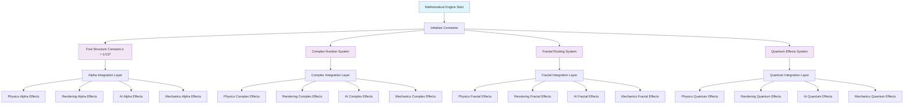
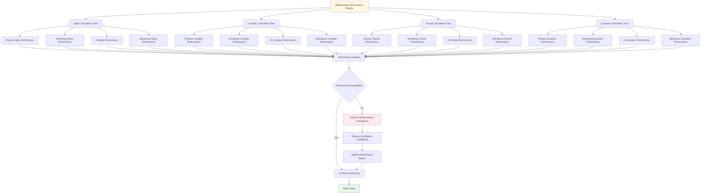

```mermaid
graph TD
    A[Physics Engine] --> B[Gravity Calculations]
    A --> C[Trajectory Calculations]
    A --> D[Collision Detection]
    A --> E[Particle Physics]
    A --> F[Soft Body Physics]
    
    B --> G[Alpha-Influenced Gravity]
    B --> H[Complex Gravity Fields]
    B --> I[Fractal Gravity Patterns]
    B --> J[Quantum Gravity Effects]
    
    C --> K[Alpha-Influenced Trajectories]
    C --> L[Complex Trajectory Paths]
    C --> M[Fractal Trajectory Patterns]
    C --> N[Quantum Trajectory Uncertainty]
    
    D --> O[Alpha-Influenced Collisions]
    D --> P[Complex Collision Detection]
    D --> Q[Fractal Collision Patterns]
    D --> R[Quantum Collision Probability]
    
    E --> S[Alpha-Influenced Particles]
    E --> T[Complex Particle Behavior]
    E --> U[Fractal Particle Patterns]
    E --> V[Quantum Particle States]
    
    F --> W[Alpha-Influenced Deformation]
    F --> X[Complex Deformation Fields]
    F --> Y[Fractal Deformation Patterns]
    F --> Z[Quantum Deformation Effects]
    
    G --> AA[Apply to Game Objects]
    H --> AA
    I --> AA
    J --> AA
    K --> AA
    L --> AA
    M --> AA
    N --> AA
    O --> AA
    P --> AA
    Q --> AA
    R --> AA
    S --> AA
    T --> AA
    U --> AA
    V --> AA
    W --> AA
    X --> AA
    Y --> AA
    Z --> AA
    
    style A fill:#e8f5e8
    style AA fill:#e3f2fd
```

```mermaid
graph TD
    A[Multiplayer System] --> B[State Synchronization]
    A --> C[Network Optimization]
    A --> D[Latency Compensation]
    A --> E[Error Recovery]
    A --> F[Performance Monitoring]
    
    B --> G[Alpha State Sync]
    B --> H[Complex State Sync]
    B --> I[Fractal State Sync]
    B --> J[Quantum State Sync]
    
    C --> K[Alpha Network Optimization]
    C --> L[Complex Network Patterns]
    C --> M[Fractal Network Optimization]
    C --> N[Quantum Network States]
    
    D --> O[Alpha Latency Compensation]
    D --> P[Complex Compensation Algorithms]
    D --> Q[Fractal Compensation Patterns]
    D --> R[Quantum Compensation Uncertainty]
    
    E --> S[Alpha Error Recovery]
    E --> T[Complex Error Handling]
    E --> U[Fractal Error Patterns]
    E --> V[Quantum Error States]
    
    F --> W[Alpha Performance Metrics]
    F --> X[Complex Performance Analysis]
    F --> Y[Fractal Performance Patterns]
    F --> Z[Quantum Performance Uncertainty]
    
    G --> AA[Apply to Network Operations]
    H --> AA
    I --> AA
    J --> AA
    K --> AA
    L --> AA
    M --> AA
    N --> AA
    O --> AA
    P --> AA
    Q --> AA
    R --> AA
    S --> AA
    T --> AA
    U --> AA
    V --> AA
    W --> AA
    X --> AA
    Y --> AA
    Z --> AA
    
    style A fill:#e0f2f1
    style AA fill:#e3f2fd
```

# Mathematical Integration Flow Documentation

*Detailed flow diagrams showing mathematical integration throughout all game systems*

---

## 🧮 Mathematical Core Flow

---

## 🌍 Physics Mathematical Integration

---

## 🎨 Rendering Mathematical Integration

```mermaid
graph TD
    A[Rendering Engine] --> B[Shader Calculations]
    A --> C[Particle Effects]
    A --> D[Post-Processing]
    A --> E[Mathematical Visualization]
    A --> F[Lighting Effects]
    
    B --> G[Alpha-Influenced Shaders]
    B --> H[Complex Shader Calculations]
    B --> I[Fractal Shader Patterns]
    B --> J[Quantum Shader Effects]
    
    C --> K[Alpha-Influenced Particles]
    C --> L[Complex Particle Systems]
    C --> M[Fractal Particle Patterns]
    C --> N[Quantum Particle Visualization]
    
    D --> O[Alpha-Influenced Post-Processing]
    D --> P[Complex Post-Processing]
    D --> Q[Fractal Post-Processing]
    D --> R[Quantum Post-Processing]
    
    E --> S[Alpha Visualization]
    E --> T[Complex Number Visualization]
    E --> U[Fractal Pattern Visualization]
    E --> V[Quantum Effect Visualization]
    
    F --> W[Alpha-Influenced Lighting]
    F --> X[Complex Lighting Fields]
    F --> Y[Fractal Lighting Patterns]
    F --> Z[Quantum Lighting Effects]
    
    G --> AA[Apply to Rendered Objects]
    H --> AA
    I --> AA
    J --> AA
    K --> AA
    L --> AA
    M --> AA
    N --> AA
    O --> AA
    P --> AA
    Q --> AA
    R --> AA
    S --> AA
    T --> AA
    U --> AA
    V --> AA
    W --> AA
    X --> AA
    Y --> AA
    Z --> AA
    
    style A fill:#f3e5f5
    style AA fill:#e3f2fd
```

---

## 🤖 AI Mathematical Integration

```mermaid
graph TD
    A[AI Engine] --> B[Neural Networks]
    A --> C[Pattern Recognition]
    A --> D[Decision Making]
    A --> E[Adaptive Learning]
    A --> F[Behavior Generation]
    
    B --> G[Alpha-Influenced Weights]
    B --> H[Complex Network Architecture]
    B --> I[Fractal Network Patterns]
    B --> J[Quantum Network States]
    
    C --> K[Alpha-Influenced Patterns]
    C --> L[Complex Pattern Recognition]
    C --> M[Fractal Pattern Matching]
    C --> N[Quantum Pattern Uncertainty]
    
    D --> O[Alpha-Influenced Decisions]
    D --> P[Complex Decision Trees]
    D --> Q[Fractal Decision Patterns]
    D --> R[Quantum Decision Superposition]
    
    E --> S[Alpha-Influenced Learning]
    E --> T[Complex Learning Algorithms]
    E --> U[Fractal Learning Patterns]
    E --> V[Quantum Learning States]
    
    F --> W[Alpha-Influenced Behavior]
    F --> X[Complex Behavior Generation]
    F --> Y[Fractal Behavior Patterns]
    F --> Z[Quantum Behavior Uncertainty]
    
    G --> AA[Apply to AI Actions]
    H --> AA
    I --> AA
    J --> AA
    K --> AA
    L --> AA
    M --> AA
    N --> AA
    O --> AA
    P --> AA
    Q --> AA
    R --> AA
    S --> AA
    T --> AA
    U --> AA
    V --> AA
    W --> AA
    X --> AA
    Y --> AA
    Z --> AA
    
    style A fill:#fce4ec
    style AA fill:#e3f2fd
```

---

## 🎮 Game Mechanics Mathematical Integration

```mermaid
graph TD
    A[Game Mechanics] --> B[Player Movement]
    A --> C[Combat System]
    A --> D[Exploration]
    A --> E[Progression]
    A --> F[Environmental Interaction]
    
    B --> G[Alpha-Influenced Movement]
    B --> H[Complex Movement Patterns]
    B --> I[Fractal Movement Paths]
    B --> J[Quantum Movement Uncertainty]
    
    C --> K[Alpha-Influenced Combat]
    C --> L[Complex Combat Mechanics]
    C --> M[Fractal Combat Patterns]
    C --> N[Quantum Combat Probability]
    
    D --> O[Alpha-Influenced Exploration]
    D --> P[Complex Exploration Paths]
    D --> Q[Fractal Exploration Patterns]
    D --> R[Quantum Exploration States]
    
    E --> S[Alpha-Influenced Progression]
    E --> T[Complex Progression Systems]
    E --> U[Fractal Progression Patterns]
    E --> V[Quantum Progression Uncertainty]
    
    F --> W[Alpha-Influenced Interaction]
    F --> X[Complex Interaction Systems]
    F --> Y[Fractal Interaction Patterns]
    F --> Z[Quantum Interaction Effects]
    
    G --> AA[Apply to Player Actions]
    H --> AA
    I --> AA
    J --> AA
    K --> AA
    L --> AA
    M --> AA
    N --> AA
    O --> AA
    P --> AA
    Q --> AA
    R --> AA
    S --> AA
    T --> AA
    U --> AA
    V --> AA
    W --> AA
    X --> AA
    Y --> AA
    Z --> AA
    
    style A fill:#fff3e0
    style AA fill:#e3f2fd
```

---

## 🌐 Multiplayer Mathematical Integration

---

## 🔄 Cross-System Mathematical Flow

```mermaid
graph TD
    A[Mathematical Engine] --> B[Physics Integration]
    A --> C[Rendering Integration]
    A --> D[AI Integration]
    A --> E[Mechanics Integration]
    A --> F[Multiplayer Integration]
    
    B --> G[Physics Alpha Effects]
    B --> H[Physics Complex Effects]
    B --> I[Physics Fractal Effects]
    B --> J[Physics Quantum Effects]
    
    C --> K[Rendering Alpha Effects]
    C --> L[Rendering Complex Effects]
    C --> M[Rendering Fractal Effects]
    C --> N[Rendering Quantum Effects]
    
    D --> O[AI Alpha Effects]
    D --> P[AI Complex Effects]
    D --> Q[AI Fractal Effects]
    D --> R[AI Quantum Effects]
    
    E --> S[Mechanics Alpha Effects]
    E --> T[Mechanics Complex Effects]
    E --> U[Mechanics Fractal Effects]
    E --> V[Mechanics Quantum Effects]
    
    F --> W[Multiplayer Alpha Effects]
    F --> X[Multiplayer Complex Effects]
    F --> Y[Multiplayer Fractal Effects]
    F --> Z[Multiplayer Quantum Effects]
    
    G --> AA[Cross-System Communication]
    H --> AA
    I --> AA
    J --> AA
    K --> AA
    L --> AA
    M --> AA
    N --> AA
    O --> AA
    P --> AA
    Q --> AA
    R --> AA
    S --> AA
    T --> AA
    U --> AA
    V --> AA
    W --> AA
    X --> AA
    Y --> AA
    Z --> AA
    
    AA --> BB[Unified Mathematical State]
    BB --> CC[Game State Update]
    CC --> DD[Next Frame]
    
    style A fill:#f3e5f5
    style DD fill:#e8f5e8
```

---

## 📊 Mathematical Performance Flow

---

*These mathematical integration flow diagrams show how the fine structure constant and mathematical principles flow through and influence every aspect of the game systems.* 